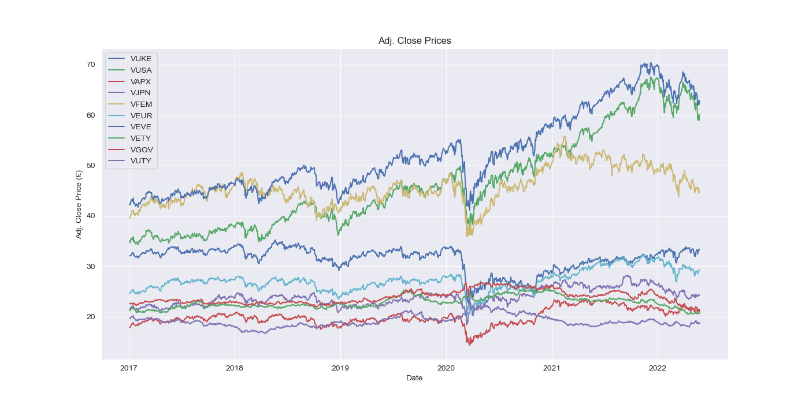
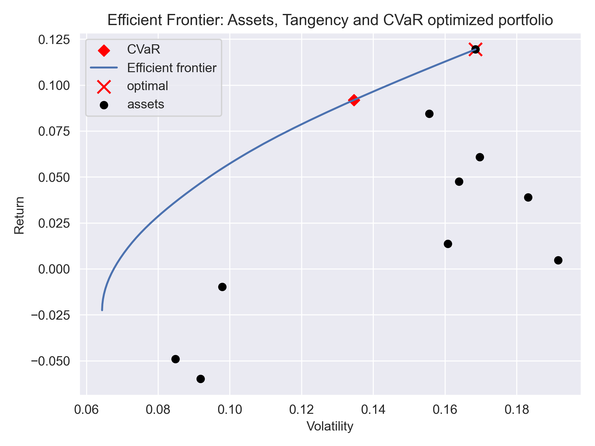

# Portfolio Optimization

Portfolio Optimization using PyPortfolioOpt. This library uses CVXPY ([paper](https://arxiv.org/abs/1603.00943)) for the underlying convex optimization problems. 

*Building an All-ETF Portfolio*

I. Equally-weighted portfolio (example)\
II. CVaR optimized, long positions only\
III. GMV optimized\
IV. Max Return for a given risk\
V. Max Sharpe Ratio

### ETFs
    # Equities
    'VUKE.L',  # FTSE100
    'VUSA.L',  # S&P500
    'VAPX.L',  # FTSE Developed Asia Pacific ex Japan
    'VJPN.L',  # FTSE Japan
    'VFEM.L',  # FTSE Emerging markets
    'VEUR.L',  # FTSE Developed Europe
    'VEVE.L',  # FTSE Developed World
    # Fixed Income
    'VETY.L',  # Eurozone Government Bond
    'VGOV.L',  # U.K. Gilt
    'VUTY.L',  # USD Treasury Bond

### Results (using pypfopt)
*Assume the total portfolio value doesn't exceed £1,000. Ignore ongoing charges.* 

I. Equally-weighted portfolio\
The equally weighted portfolio had return 0.0395 and volatility equal to 0.1103.\
VaR: -1.11%
CVaR: -1.64%

II. 5% CVaR optimized, long positions only\
Allocation:  {'VUSA': 13, 'VUTY': 11}\
Leftover:  7.27250862121582\
Expected annual return: 8.9%\
Conditional Value at Risk: 2.00%\
Annual Volatility:13.46% 

III. GMV optimized\
Allocation:  {'VUKE': 6, 'VETY': 13, 'VGOV': 15, 'VUTY': 11}\
Leftover:  4.7263946533203125\
Expected annual return: -2.1%\
Annual volatility: 6.4%\
Sharpe Ratio: -0.64

IV. Max Return for a given risk (8%)\
Allocation:  {'VUKE': 4, 'VUSA': 3, 'VEVE': 2, 'VETY': 5, 'VGOV': 8, 'VUTY': 15}\
Leftover:  6.301488876342773\
Expected annual return: 2.4%\
Annual volatility: 8.0%\
Sharpe Ratio: 0.05

V. Max Sharpe\
Allocation:  {'VUSA': 16}\
Leftover:  31.96002197265625\
Expected annual return: 11.4%\
Annual volatility: 16.8%\
Sharpe Ratio: 0.56\
*The risk-free rate is set at 0.02.* 

